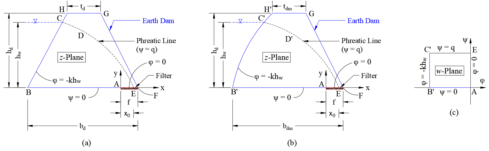
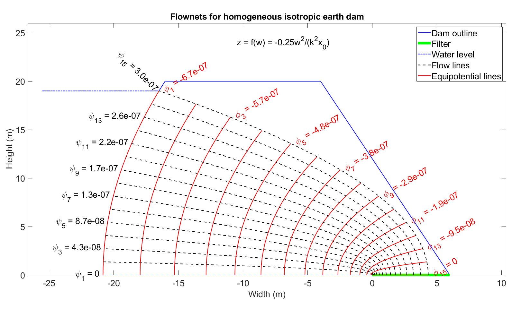

# Seepage Analysis

<p align="justify"> 
In hydrogeology or soil mechanics, the flownet is an important tool for solving two-dimensional irrotational flow problems in the presence of hydraulic structures like dams or sheet pile walls. Initially, the construction of the flownet evolved as a graphical method considering some physical constraints of representing the flow lines and the equipotential (piezometric) lines. Later analytical functions of complex variables, satisfying steady-state flow conditions by following the Laplace equation, were used to find some closed-form solutions for flow domains with simple boundary conditions. However, the process becomes extremely complicated when the flow domain is irregular in shape or unknown altogether. In this scenario, methods of conformal mapping can be used successfully to transform an unconfined flow domain (through an earth dam) or confined flow domain (underneath a concrete dam) into a simple rectangular domain or a half-space plane where the closed-form solutions can be obtained easily. Further, the solutions can be mapped inversely to the original flow domain. The Laplace invariant property of conformal mapping ensures the correctness of the solutions after inverse mapping from the simple domain to the original domain. 
</p>

## Earth Dam

<p align="justify"> 
Let us define two spatial coordinates, viz., a velocity potential function $\varphi(x,y)$ and a stream function $\psi(x,y)$. $\varphi(x,y)$ and $\psi(x,y)$ are chosen such that they satisfy the governing Laplace equation of the steady-state flow, i.e., $\nabla^2 \varphi(x,y) = 0$ and $\nabla^2 \psi(x,y) = 0$. The two functions $\varphi(x,y)$ and $\psi(x,y)$ are conjugate harmonic (i.e., they follow the Cauchy-Riemann equation), meaning that the two families of curves given by $\varphi(x,y) = \mathrm{constant}$ and $\psi(x,y) = \mathrm{constant}$ represent mutually perpendicular trajectories. Let us consider two complex planes $z$ and $w$, respectively, such that $$z=x+\mathrm{i}y\quad\mathrm{and}\quad w=\varphi+\mathrm{i}\psi\quad\mathrm{with\quad i}=\sqrt{-1} \tag{1}$$ Now, the Kozeny's solution for flow through the earth dams, as shown in Figure 1(b) can be obtained using the following simple transformation $$z = Cw^2\quad\Rightarrow x+iy = C(\varphi^2+i2\varphi\psi-\psi^2) \tag{2}$$ $$\therefore x = C(\varphi^2-\psi^2) \quad \mathrm{and} \quad y = 2C\varphi\psi\tag{3}$$ where, $C$ is a constant, depending on the boundary conditions of the problem. Now, along the free surface CDE (commonly known as the phreatic line or line of seepage), $\psi=q$ and $\varphi=-ky$, where $k$ is the coefficient of hydraulic conductivity (or the coefficient of conductivity) of the soil. Therefore, Equation (3) yields $$C=-\dfrac{1}{2kq}\tag{4}$$ The equation for the line of seepage, referred to as Kozeny's basic parabola, can be obtained as $$x = -\dfrac{1}{2kq}(\varphi^2-\psi^2) = -\dfrac{1}{2kq}(k^2y^2-q^2) = \dfrac{1}{2} \left(\dfrac{q}{k}-\dfrac{k}{q}y^2 \right) \tag{5}$$ It should be noted that the real upstream slope of the dam or face BCH (as shown in Figure 1(a)) is modified as a parabola, face B'C'H' in the $z$-plane (as shown in Figure 1(b)). This is in anticipation of the shape of the obtained flownets in the $z$-plane (refer to Figure 2), and correction should be made to account for this discrepancy. The focal distance $x_0$ can be estimated by putting $y=0$ at equation 5 as $$x_0=\dfrac{q}{2k}\quad\Rightarrow q=2kx_0 \tag{6}$$ Therefore, Kozeny's basic parabola can be expressed as $$x = \dfrac{1}{2}\left( 2x_0-\dfrac{y^2}{2x_0}\right) = x_0-\dfrac{y^2}{4x_0} \tag{7}$$ Here, the value of $x_0$ can be estimated by considering the coordinate of the point $C (x_C,y_C)$ from Figure 1(a) as $$x_0 = 0.5 \left( x_C+\sqrt{x_C^2+y_C^2} \right); \quad x_C=h_w; \quad y_C=-b_d+f+0.5h_w(b_d-t_d)/h_d \tag{8}$$ Finally, the complex transformation can be expressed by using Equations (4) and (6) as $$z=f(w)=-\dfrac{w^2}{4k^2x_0}\tag{9}$$ 
</p>

<p align="center">
    
</p>
<p align="center"> Figure 1: (a) realistic geometric shape of an earth dam in $z$-plane, (b) modified geometric shape of an earth dam in $z$-plane, (c) boundary conditions of flownets in $w$-plane </p>

*Example*
<p align="justify"> 
Consider an earth dam with a height equal to $20\ \mathrm{m}$, a top width equal to $12\ \mathrm{m}$, a bottom width equal to $32\ \mathrm{m}$, and the filter width equal to $6\ \mathrm{m}$ as shown in Figure 2. The height of the water level is $19\ \mathrm{m}$, and the coefficient of permeability of the homogenous isotropic soil is $3.5\times 10^{-8}\ \mathrm{m/s}$. A simple MATLAB script to generate the flownets (combinations of flowlines and equipotential lines) for the considered earth bank is provided below, and the output of the code is shown in Figure 2.
</p>

```Matlab
%==================================================================================================
% PREPARED BY SUBHADIP NASKAR, RESEARCH SCHOLAR, IIT GUWAHATI
%==================================================================================================
clear all; clc; warning('off','all')
%==================================================================================================
% INPUTS::
%--------------------------------------------------------------------------------------------------
% Note: all the geometric inputs are provided considering the realistic shape of an earth dam. The
% program will take care to estimate the geometric parameters required for the geometrically
% modified earth dam.
%--------------------------------------------------------------------------------------------------
hd = 20;            % Height of the dam (m)
hw = 19;            % Height of the water level (m)
td = 12;            % Top width of the dam (m)
f = 6;              % Width of the filter (m)
bd = 32;            % Bottom width of the dam (m)
k = 3.5*10^(-8);    % Coefficient of permeability (m/s)
%==================================================================================================
% required for optimize scaling of the plot area
fl = 15;            % Numbers of flow lines (odd number)
yf = 1.3;           % Depth factor
xf = 1.2;           % Width factor
%==================================================================================================
% DERIVED PARAMETERS::
C = [-bd+f+0.5*(bd-td)*hw/hd hw]; 
xo = 0.5*(C(1)+sqrt(C(1)^2+C(2)^2)); 
q = 2*k*xo; 
C = -1/(2*k*q); 
ss = 2*hd/(bd-td);
%==================================================================================================
% PLOT OF THE MODIFIED EMBANKMENT DAM IN Z-PLANE::
p1 = [-bd+f 0]; 
p2 = [p1(1)+hd/ss hd]; 
p3 = [p2(1)+td hd]; 
p4 = [f 0];
for i = 1:6
    if i == 1
        x1 = p1(1); y1 = p1(2); 
        x2 = p2(1); y2 = p2(2);
        yy = linspace(y1,y2,2000); 
        xx = 0.5*(q*yy.^2/(k*hw^2)-k*hw^2/q);
        p1(1) = min(xx); 
        p2(1) = max(xx); 
    elseif i == 2 
        x1 = p2(1); y1 = p2(2); 
        x2 = p3(1); y2 = p3(2);
    elseif i == 3 
        x1 = p3(1); y1 = p3(2); 
        x2 = p4(1); y2 = p4(2);
    elseif i == 4 
        x1 = 0; y1 = 0; 
        x2 = p1(1); y2 = p1(2);
    elseif i == 5 
        x1 = p4(1); y1 = p4(2); 
        x2 = 0; y2 = 0;
    else
        x1 = p2(1)-hw/ss; y1 = hw; 
        y2 = hw; x2 = 0.5*(q*y2^2/(k*hw^2)-k*hw^2/q);
    end
    if i ~= 1 
        xx = linspace(x1,x2,2000); 
        m = (y2-y1)/(x2-x1); 
        yy = m.*xx-m*x1+y1; 
    end
    figure (1); 
    xlim([-bd/xf xf^3*f]); 
    ylim([0 yf*hd]); 
    hold on; set(gca,'FontSize',20); box on;
    if i <= 4
        if i == 1 
            leg1 = plot(xx,yy,'b','linewidth',1.5); 
        end
        plot(xx,yy,'b','linewidth',1.5);
    elseif i == 5 
        leg2 = plot(xx,yy,'g','linewidth',6);
    else
        leg3 = plot(xx,yy,'b-.','linewidth',1.5);
    end
end
%==================================================================================================
% FLOWNETS IN W-PLANE::
x = linspace(-k*hw,0,fl); 
y = linspace(0,q,fl);
for i = 1:fl
    xx = linspace(0,-k*hw,100); yx = y(i)*diag(eye(100)); % '||' to x-axis
    xy = x(i)*diag(eye(100)); yy = linspace(0,q,100);     % '||' to y-axis
    wx(i,1:100) = complex(xx,yx'); 
    wy(i,1:100) = complex(xy',yy); 
end
%==================================================================================================
% FLOWNETS IN Z-PLANE::
zx = C*wx.^2; 
zy = C*wy.^2; 
%==================================================================================================
% PLOT OF THE FLOWNETS IN Z-PLANE::
for i = 1:fl
    leg4 = plot(real(zx(i,:)),imag(zx(i,:)),'k--','linewidth',1.5);
    leg5 = plot(real(zy(i,:)),imag(zy(i,:)),'r','linewidth',1.5);
end
xlabel('Width (m)','fontsize',20); 
ylabel('Height (m)','fontsize',20)
title('Flownets for homogeneous isotropic earth dam','fontsize',20)
legend([leg1 leg2 leg3 leg4 leg5],{'Dam outline','Filter','Water level','Flow lines',...
'Equipotential lines'},'fontsize',20)
for i = 1:2:fl
    if i == fl 
        t1 = ['\phi_{',num2str(i),'} = ',num2str(x(i))]; 
    else
        t1 = ['\phi_{',num2str(i),'} = ',num2str(x(i),'%10.1e')]; 
    end
    if i == 1 
        t2 = ['\psi_{',num2str(i),'} = ',num2str(y(i))]; 
    else
        t2 = ['\psi_{',num2str(i),'} = ',num2str(y(i),'%10.1e')]; 
    end
    xc1 = max(real(zy(i,:))); 
    yc1 = max(imag(zy(i,:)));
    ht1 = text(xc1+0.4,yc1,t1,'HorizontalAlignment','left','Color','r','fontsize',20); 
    set(ht1,'Rotation',30); 
    xc2 = min(real(zx(i,:))); 
    yc2 = max(imag(zx(i,:)));
    ht2 = text(xc2-0.25,yc2,t2,'HorizontalAlignment','right','Color','k','fontsize',20); 
    if (i == fl) 
        set(ht2,'Rotation',-45); 
    end
end
t = ['z = f(w) = -0.25w^2/(k^2x_0)']; 
text(-10.5,24,t,'HorizontalAlignment','left','Color','k','fontsize',20)
%==================================================================================================
```
<p align="center">
    
</p>
<p align="center"> Figure 2: flownets for a homogeneous isotropic earth dam </p>

## Flat-bottomed concrete gravity dam


