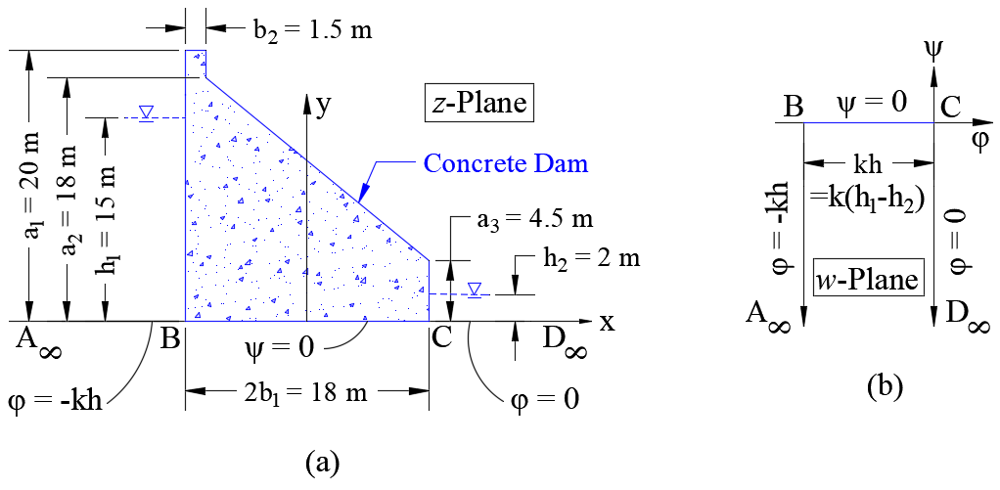

# Seepage Analysis

 
In hydrogeology or soil mechanics, the flownet is an important tool for solving two-dimensional irrotational flow problems in the presence of hydraulic structures like dams or sheet pile walls. Initially, the construction of the flownet evolved as a graphical method considering some physical constraints of representing the flow lines and the equipotential (piezometric) lines. Later analytical functions of complex variables, satisfying steady-state flow conditions by following the Laplace equation, were used to find some closed-form solutions for flow domains with simple boundary conditions. However, the process becomes extremely complicated when the flow domain is irregular in shape or unknown altogether. In this scenario, methods of conformal mapping can be used successfully to transform an unconfined flow domain (through an earth dam) or confined flow domain (underneath a concrete dam) into a simple rectangular domain or a half-space plane where the closed-form solutions can be obtained easily. Further, the solutions can be mapped inversely to the original flow domain. The Laplace invariant property of conformal mapping ensures the correctness of the solutions after inverse mapping from the simple domain to the original domain. 

## Earth Dam

 
Let us define two spatial coordinates, viz., a velocity potential function $\varphi(x,y)$ and a stream function $\psi(x,y)$. $\varphi(x,y)$ and $\psi(x,y)$ are chosen such that they satisfy the governing Laplace equation of the steady-state flow, i.e., $\nabla^2 \varphi(x,y) = 0$ and $\nabla^2 \psi(x,y) = 0$. The two functions $\varphi(x,y)$ and $\psi(x,y)$ are conjugate harmonic (i.e., they follow the Cauchy-Riemann equation), meaning that the two families of curves given by $\varphi(x,y) = \mathrm{constant}$ and $\psi(x,y) = \mathrm{constant}$ represent mutually perpendicular trajectories. Let us consider two complex planes $z$ and $w$, respectively, such that $$z=x+\mathrm{i}y\quad\mathrm{and}\quad w=\varphi+\mathrm{i}\psi\quad\mathrm{with\quad i}=\sqrt{-1} \tag{1}$$ Now, the Kozeny's solution for flow through the earth dams, as shown in Figure 1(b) can be obtained using the following simple transformation $$z = Cw^2\quad\Rightarrow x+iy = C(\varphi^2+i2\varphi\psi-\psi^2) \tag{2}$$ $$\therefore x = C(\varphi^2-\psi^2) \quad \mathrm{and} \quad y = 2C\varphi\psi\tag{3}$$ where, $C$ is a constant, depending on the boundary conditions of the problem. Now, along the free surface CDE (commonly known as the phreatic line or line of seepage), $\psi=q$ and $\varphi=-ky$, where $k$ is the coefficient of hydraulic conductivity (or the coefficient of conductivity) of the soil. Therefore, Equation (3) yields $$C=-\dfrac{1}{2kq}\tag{4}$$ The equation for the line of seepage, referred to as Kozeny's basic parabola, can be obtained as $$x = -\dfrac{1}{2kq}(\varphi^2-\psi^2) = -\dfrac{1}{2kq}(k^2y^2-q^2) = \dfrac{1}{2} \left(\dfrac{q}{k}-\dfrac{k}{q}y^2 \right) \tag{5}$$ It should be noted that the real upstream slope of the dam or face BCH (as shown in Figure 1(a)) is modified as a parabola, face B'C'H' in the $z$-plane (as shown in Figure 1(b)). This is in anticipation of the shape of the obtained flownets in the $z$-plane (refer to Figure 2), and correction should be made to account for this discrepancy. The focal distance $x_0$ can be estimated by putting $y=0$ at equation 5 as $$x_0=\dfrac{q}{2k}\quad\Rightarrow q=2kx_0 \tag{6}$$ Therefore, Kozeny's basic parabola can be expressed as $$x = \dfrac{1}{2}\left( 2x_0-\dfrac{y^2}{2x_0}\right) = x_0-\dfrac{y^2}{4x_0} \tag{7}$$ Here, the value of $x_0$ can be estimated by considering the coordinate of the point $C (x_C,y_C)$ from Figure 1(a) as $$x_0 = 0.5 \left( x_C+\sqrt{x_C^2+y_C^2} \right); \quad x_C=h_w; \quad y_C=-b_d+f+0.5h_w(b_d-t_d)/h_d \tag{8}$$ Finally, the complex transformation can be expressed by using Equations (4) and (6) as $$z=f(w)=-\dfrac{w^2}{4k^2x_0}\tag{9}$$ 

    

 Figure 1: (a) realistic geometric shape of an earth dam in $z$-plane, (b) modified geometric shape of an earth dam in $z$-plane, (c) boundary conditions of flownets in $w$-plane 

*Example*

 
Consider an earth dam with a height equal to $20\ \mathrm{m}$, a top width equal to $12\ \mathrm{m}$, a bottom width equal to $32\ \mathrm{m}$, and the filter width equal to $6\ \mathrm{m}$ as shown in Figure 2. The height of the water level is $19\ \mathrm{m}$, and the coefficient of permeability of the homogenous isotropic soil is $3.5\times 10^{-8}\ \mathrm{m/s}$. A simple <a href="https://github.com/SubhadipN/Conformal_Mapping/blob/main/seepage_earth_dams_isotropic_soil.m">MATLAB script</a> to generate the flownets (combinations of flowlines and equipotential lines) for the considered earth bank is provided in this repository, and the output of the code is shown in Figure 2.

    

 Figure 2: flownets for a homogeneous isotropic earth dam 

## Flat-bottomed concrete gravity dam

 
In this section, the realistic boundary conditions for flownets underneath a flat-bottomed concrete gravity dam (see Figure 3(a)) are identified in the physical domain or $z$-plane, and then accordingly considered in the $w$-plane as shown in Figure 3(b). Thereafter the analytical expressions for the flownets will be solved in the $w$-plane, and then a transformation scheme will be used to map the solutions onto the physical plane. For this problem, the complex velocity $W$, can be expressed as $$W=\dfrac{dw}{dz}=\dfrac{\partial \varphi}{\partial x}+\mathrm{i}\dfrac{\partial \psi}{\partial x} = v_x-\mathrm{i}v_y \tag{10}$$ Further, $W$ can be expressed in terms of $z$ to obtain the transformation function as $$W = v_x-\mathrm{i}v_y = \dfrac{M}{\sqrt{b^2-z^2}}\tag{11}$$ where $M$ is the real constant and $2b$ is the width of the dam (refer to Figure 3(a)). The main reason for choosing the function is that it follows the velocity conditions at the boundaries in the physical domain. It should be noted that $W$ is real along line $BC$ (where $-b<x<b$) and imaginary along lines $A_{\infty}B$ and $CD_{\infty}$ (where $|x|>b$) according to Equation (11). This is consistent with the flow velocities being horizontal along $BC$ (i.e. $v_x\neq 0,v_y=0$) and vertical along $A_{\infty}B$ and $CD_{\infty}$ (i.e. $v_x=0,v_y\neq 0$). Now, Equations (10) and (11) yield $$dw = Wdz \quad \Rightarrow w = \int \dfrac{M}{\sqrt{b^2-z^2}} \ dz \qquad \therefore w = \varphi +\mathrm{i}\psi = M\sin^{-1} (z/b)+N\tag{12}$$ where $N$ is the constant of integration. The following boundary conditions are used to find the constants $M$ and $N$. $$\text{At point B:} \quad \psi = 0, \ \varphi = -k(h_1-h_2)=-kh, \ w=-kh, \ z = -b; \qquad \Rightarrow -\frac{M\pi}{2}+N=-kh$$ $$\text{At point C:} \quad \psi = 0, \ \varphi = 0, \ w=0, \ z = b; \qquad \Rightarrow \frac{M\pi}{2}+N=0$$ Therefore, $M=kh/\pi$ and $N=-kh/2$, and the relations between $z$- and $w$-planes can be expressed as $$w = \frac{kh}{\pi}\sin^{-1}\left(\frac{z}{b}\right)-\frac{kh}{2}=\frac{kh}{\pi}\left[ \frac{\pi}{2}-\cos^{-1}\left(\frac{z}{b}\right)\right]-\frac{kh}{2} = -\frac{kh}{\pi}\cos^{-1}\left(\frac{z}{b}\right) \tag{13}$$ $$\Rightarrow z = f(w) = b\cos(\pi w/kh) \tag{14}$$

    

 Figure 3: (a) geometry of a flat-bottomed concrete gravity dam in $z$-plane, (b) boundary conditions of flownets in $w$-plane 

